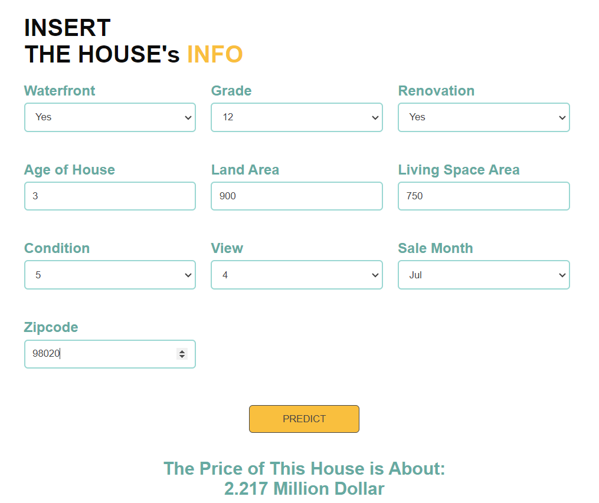

# Complete House Price Predictor (ML)

## Project Overview

Welcome to the Real Estate Price Prediction Project! This data science journey guides you through the development of a real estate price prediction system using the King County house prices dataset. Our project spans multiple key phases, each essential in the journey to building an accurate prediction system.

## Key Phases

### 1. Data Analysis and Exploration

In the initial phase, we embark on a data exploration journey that serves as the foundation of our project. Here's what you can expect in this phase:

- **Statistical Analysis**: We dive deep into the dataset, examining summary statistics and distributions of key variables. This step helps us understand the data's overall structure.

- **Exploratory Data Analysis (EDA)**: EDA takes our analysis a step further. We visualize data relationships, uncover outliers, and identify patterns that inform our modeling choices.

- **Data Visualization**: Our use of Matplotlib and Seaborn results in insightful visualizations. We create various plots, from bar charts to scatter plots, to understand the data visually.

### 2. Machine Learning Model Development

The heart of our project lies in the development of powerful machine-learning models. This phase covers a range of essential topics:

- **Data Preprocessing**: We carefully get the data ready for modeling by checking if there are missing values, replacing some features with others, and applying (log transformation) for some skewed features.

- **Feature Engineering**: I crafted additional features within the dataset, not only improving our models' prediction accuracy but also enhancing my understanding of the data and gaining valuable insights.

- **Feature Selection**: Not all features are created equal. We share our criteria and methodologies for selecting the most relevant features to improve model efficiency and user experience.

- **Model Selection**:
  - LinearRegression
  - DecisionTreeRegressor
  - RandomForestRegressor
  - XGBRegressor
  - Lasso
  - Ridge
  - ElasticNet
  - KNeighborsRegressor
  - GradientBoostingRegressor
  - LGBMRegressor
  - CatBoostRegressor

- **Model Evaluation**:
  - We assessed each model's performance using various metrics and criteria to determine which one suits our prediction task best. Additionally, we applied hyperparameter tuning using grid search to optimize each model's settings.

### 3. Flask Web Server Implementation

Our third component introduces a Python Flask server that serves as the bridge between our models and the user interface. Key details include:

- **HTTP Requests**: We delve into how the Flask server handles incoming HTTP requests and processes user input.

- **Model Deployment**: Learn how we deploy our trained machine learning model within Flask.

### 4. User-Friendly Website

The fourth and final component enhances user interaction. We've created a user-friendly website using HTML and CSS. This intuitive interface empowers users to input their property details and receive accurate price predictions.

## Project Technologies and Tools

Our project relies on a wide range of data science and development tools, and each of them is important for the project's success:

- **Python** for scripting and programming.
- **NumPy** and **Pandas** for robust data cleaning and manipulation.
- **Matplotlib** and **Seaborn** for visually stunning data exploration and visualization.
- **Scikit-learn** and other machine learning libraries for model development.
- **Jupyter Notebook** and **Visual Studio Code** as integrated development environments (IDEs).
- **Python Flask** for creating the HTTP server.
- **HTML** and **CSS** for creating an inviting and user-friendly interface.

## Contribution

We welcome contributions from the community! Whether you have bug reports, feature requests, or code contributions, your involvement enriches our project.

## License

This project is released under the [MIT License](LICENSE). Feel free to use, modify, and distribute it as per the terms of the license.
